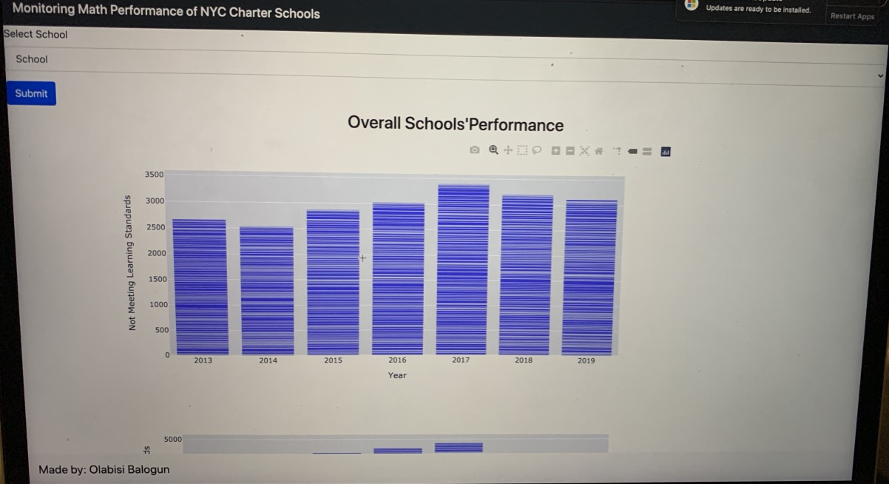
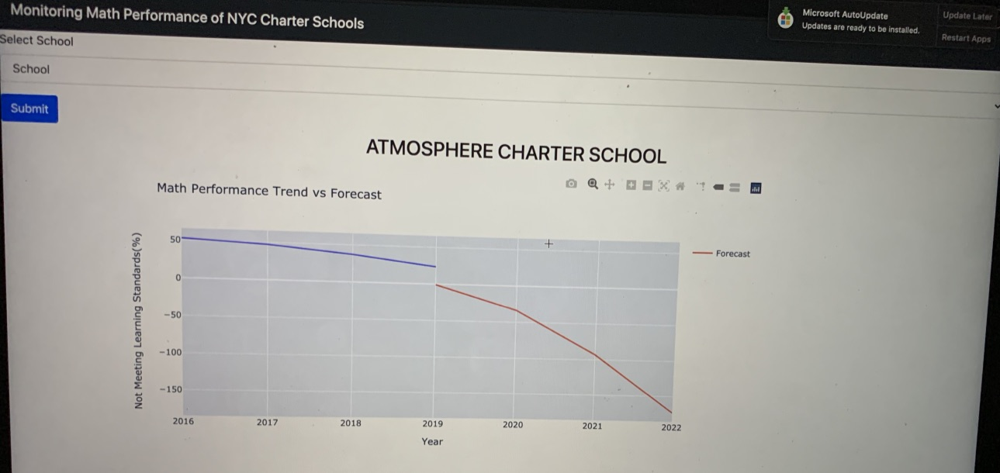
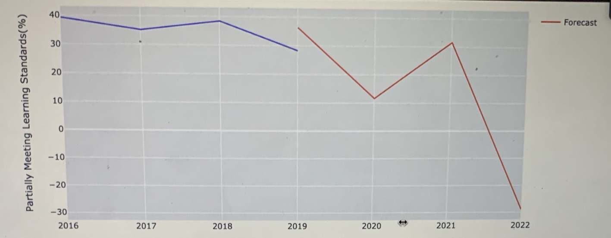
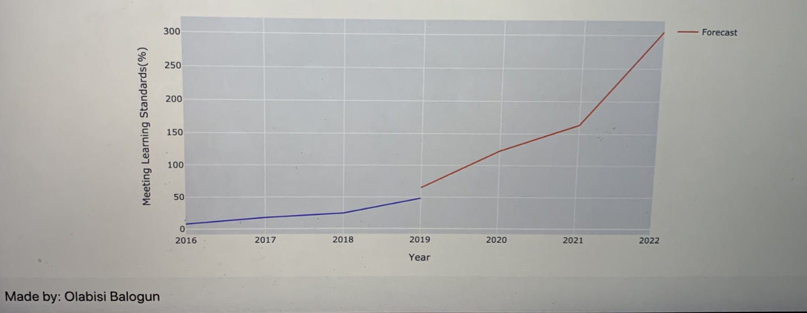

# School_Performance_Prediction
### Project Motivation

The goal of the project is to design an application to predict the performance ratio of students in Math in a specific charter school in New York City. The application predicts the percentage of students that would fall into each of the performance standards - Meeting Standards, Partially Meeting Standards, and Not Meeting Standards.

### Built With:
* Python 3
* Boostrap
* Pandas
* Numpy
* Plotly
* Flask

### File Description
 #### Application File
  * charter.py #Flask file that runs the web application
#### Model
 * train_model.py #python file that trains the model for individual schools
 * forecast.p #pickle file for the saved models
#### Data Files
 * 2013-2019_Math_Test_Results_Charter_-_School #raw data from nyc open data website
 * nyc_charter_format.csv #clean version of the raw data
 * nyc_charter_grp.csv #further processed data file
 
#### Web File
* template 
  |-index.html #main page of the web app  
  |-result.html #the forecast and trend result page for each selected school
 
#### Analysis File
 * Udacity_FinalProject.ipynb #Overall Project report, Data Analysis, and Findings
 
### Getting Started
 * Installation
    Install Anaconda or Python version 3, pandas, numpy, and statsmodels v0.13.0.dev0 (+171)
 * Instructions
  1. To run the web application, enter charter.py in the terminal
  2. Go to http://0.0.0.0:3001/
  3. To follow the Data cleaning,preprocessing, and analysis, use the jupyter notebook: Udacity_FinalProject.ipynb
  
### Usage
 * Select charter school of interest from the drop downmenu, then click the submit button
 
 
 
 * Visualizations of trend and forecast in each learning standard
 
 
 
 
 ### License
 MIT License
 
 Copyright (c) [2021] [Olabisi Balogun]

 
